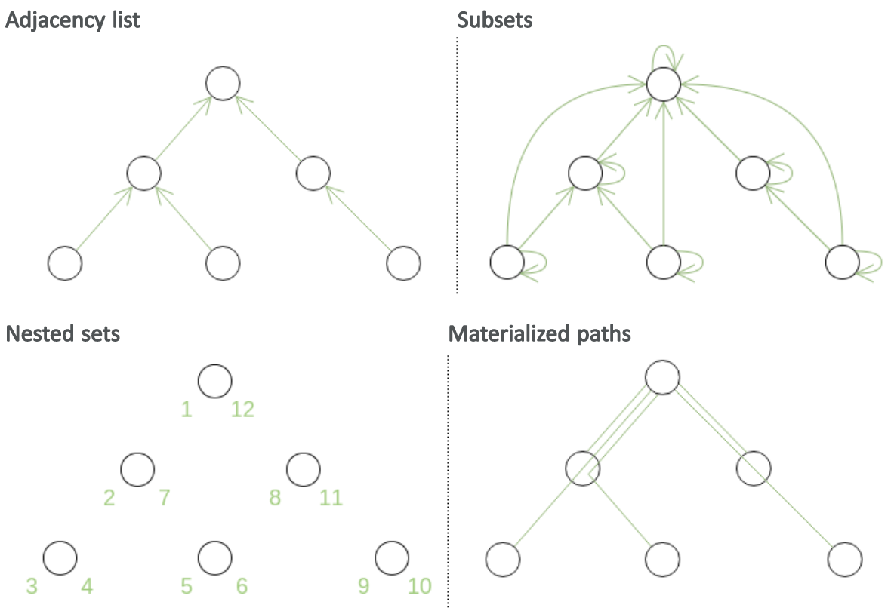

# HR Application

### Minimum requirements:
* a recent version of _docker_ has to be already installed

### Storing trees in RDBMS
Trees are one of the ways to represent hierarchical structures and thus are used in many problem domains. Representing and storing data in a tree-like structure is a common problem in software development.

- Although Neo4J would be a better DB to store to operate with graphs, I decided to go with a traditional RDBMS (postgresql)
- Four most popular methods for storing tree-like structures in relational databases are:
  - Adjacency lists
  - Subsets(aka Closure table, Bridge table)
  - Nested sets
  - Materialized paths (aka Lineage column)

Out of the four, only the `Adjacency list` method avoids redundancy and doesn't require non-referential integrity constraints; insert and move operations don't affect other records in the database. However, at least some kind of recursion is necessary for most queries.

The three other methods don't need recursion for their queries, however insert and move operations can't be performed without updating other associated nodes. The materialized paths and nested sets methods have possible optimizations, which deal only with some of their limitations.

The following figure uses green color to schematically denote what data is actually stored in relational database for each of the above-mentioned tree storage methods.



### Current implementation
I've decided to solve this task choosing `Materialized paths`, and using `ltree` module of Postgres for working efficiently with trees: it allows employing efficient implementation of the Materialized paths method in a convenient manner.

The graph table and its relationship with node table could be removed by placing an artificial path prefix for each correlated node(e.g. `{org_id}.*`), then the graph could be easily filtered by executing this command: 
```sql
SELECT * FROM node WHERE path <@ (SELECT path FROM node WHERE name = ':org_id');
```

### Content
* Run the tests: `./gradlew clean test -i`
* The following commands are provided to run the applications with`docker-compose`:

Operation | Command
--------- | ----------
Start:    | `./start.sh`
Stop:     | `./stop.sh`
Restart:  | `./restart.sh`

- [actuator](http://localhost:8080/actuator)
- [health check](http://localhost:8080/actuator/health)
- [API docs](http://localhost:8080/swagger-ui/index.html?configUrl=/v3/api-docs/swagger-config)

After starting the service, you can start testing it using OpenAPI docs(or using the postman_collection).

The authentication is simplified by implementing Basic Auth of each request(not optimal, oauth2 would be a better choice)
To authorize every request, you need to click to `Authorize` button, and add `abc123` as api key (easy configurable at `/src/main/resources/application.yml`).
